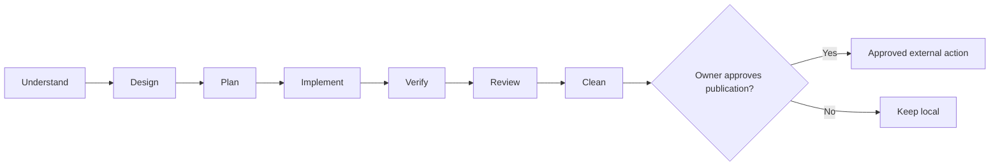

# Agentic Engineering Skills

A collection of composable engineering skills and agent profiles for Codex and Claude Code, covering discovery, design, frontend craft, planning, fidelity-first handoff import, implementation, review, and cleanup.

## Problem

Agent work often jumps from a vague request to code, skipping design, test-first execution, faithful handoff import, integrated review, or cleanup. This pack supplies focused skills spanning that whole path while keeping every distributed file traceable to a pinned source.

## Philosophy

Move from evidence to explicit decisions, durable specifications and plans, isolated implementation, independent verification, and owner-approved publication. Use the smallest skill set needed for current work: skills guide judgment, but do not replace project instructions or turn a plan or passing test suite into permission to publish. See the [workflow philosophy](docs/philosophy.md) for lifecycle gates, handoff evidence, optional-tool fallbacks, and human authority boundaries.

Vendor files stay byte-exact, adaptations remain auditable, and original files use this repository's MIT license. `how-to-use-codex` keeps prompt and model guidance aligned with current official OpenAI documentation. Frontend work can add `impeccable` for craft and critique plus `ui-ux-pro-max` for searchable design intelligence and stack-specific guidance.

## Workflow

Work moves through seven composable phases, then stops at an explicit owner publication gate. `codex-implement` is the Codex route; `claude-implement` is the Claude Code route. See the [workflow guide](docs/workflow.md) for detailed routing, the [workflow philosophy](docs/philosophy.md) for evidence and authority boundaries, and the [agent profile guide](docs/agent-profiles.md) for delegation contracts.



## Install

Install complete bundle. This is supported path.

Codex:

```text
codex plugin marketplace add GiuseppeVe/agentic-engineering-skills
codex plugin add agentic-engineering-skills@agentic-engineering-skills
```

Claude Code:

```text
claude plugin marketplace add GiuseppeVe/agentic-engineering-skills
claude plugin install agentic-engineering-skills@agentic-engineering-skills
```

Confirm discovery with `codex plugin list --available --json` or `claude plugin list`. Then start a fresh host session and invoke one included skill, such as `brainstorming`; plugin listing alone does not prove fresh-session invocation.

Selective copying is advanced and can remove workflow stages. See [selective installation](docs/selective-install.md).

## Customize

Fork repository and edit source files, never generated plugin cache. Full workflow: [customization guide](docs/customization.md).

## Compatibility

Bundle targets exactly two verified hosts: Codex and Claude Code. Release-specific validation evidence belongs in `docs/release-report.md`. See [compatibility](docs/compatibility.md).

## Provenance

Every skill is classified as `vendor`, `adapted`, or `original`, with hashes and pinned revisions in lock. See [provenance inventory](docs/provenance.md).

## License

Repository-original material: [MIT](LICENSE), copyright GiuseppeVe. Third-party material remains under applicable retained licenses; see [Third-Party Notices](THIRD_PARTY_NOTICES.md). Forking, editing, removal, and redistribution remain subject to those licenses.
