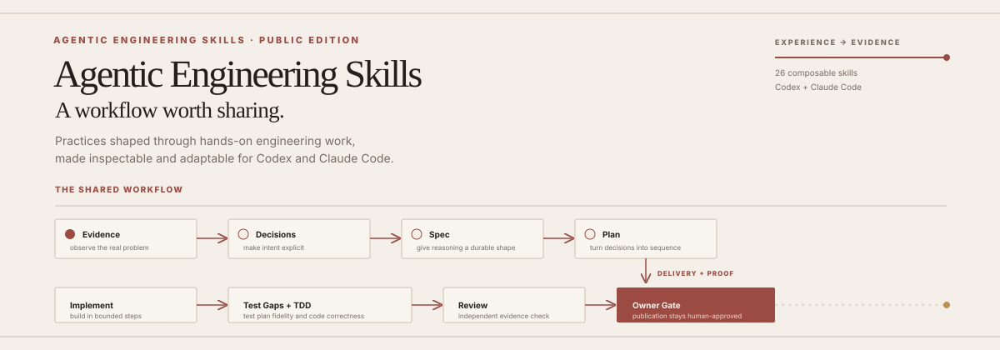
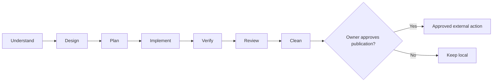

# Agentic Engineering Skills



I share this experience-shaped workflow from hands-on engineering work so others can inspect, adapt, and reuse it.

## What this repository shares

This repository is an experience-shaped collection of composable skills and agent profiles for Codex and Claude Code. It makes reasoning, sequencing, verification, and ownership visible enough to inspect and adapt in another project; it is a working practice, not a course or universal prescription.

## My working philosophy

I start from evidence instead of an implementation guess, then turn decisions into durable specifications and traceable plans. I isolate implementation work, keep worker output separate from independent evidence, and use two quality dimensions: whether delivery remains faithful to its plan and whether implemented behavior is correct. Publication and other external actions stay under explicit owner control; a plan or passing test suite does not grant publication permission.

Vendor files remain byte-exact, adaptations stay auditable, and repository-original files use this repository's MIT license. [Workflow philosophy](docs/philosophy.md) records lifecycle gates, handoff evidence, optional-tool fallbacks, and human authority boundaries.

## How I use the workflow

These are composable choices, not mandatory stages for every task.

| Situation | Path | Purpose |
| --- | --- | --- |
| Large, uncertain initiative | `Wayfinder` | Map scope that reaches beyond one session. |
| Bounded or creative design | `Brainstorming` | Clarify intent before changes. |
| Consequential or disputed design | `Grill-me` | Pressure-test assumptions. |
| Agreed design | `To Spec` | Create standalone specification. |
| Multi-step implementation | `Writing Plans` | Create traceable implementation plan. |
| large implementation | `Sequential Task Orchestrator` | Run one bounded task at a time with review. |
| small implementation | `Codex Implement` | Execute focused change with relevant verification. |
| Claude Code implementation | `Claude Implement` | Use host-equivalent bounded workflow. |

See [workflow guide](docs/workflow.md) for routing detail and [agent profile guide](docs/agent-profiles.md) for delegation contracts.

## The quality loop

For ordered work, `Test Gaps` checks plan fidelity: it compares delivery with plan and finds missing or incomplete coverage. `Test-Driven Development` checks implementation correctness through failing tests, implementation, and passing tests. Findings return through the TDD fix cycle before acceptance, then independent evidence informs review.

## Supporting skills

I use `Impeccable` and `UI UX Pro Max` for frontend craft and design support, `Caveman` to compress communication without losing technical substance, and `How to Use Codex` for current official guidance on model-aware prompting, settings, and delegation. `Cleaning Repo with Knip` keeps the repository lean through verified cleanup, reviewable branches, and a durable false-positive record instead of blind deletion. `Improve Codebase Architecture` helps me identify where modules lack depth or locality, so I can choose focused refactors that improve leverage and testability. Graph Engineering V5.2 is planned and excluded from this inventory until implementation is complete and validated.

## Example: from request to reviewed change

```text
large/uncertain request
→ Wayfinder
→ Brainstorming or Grill-me
→ To Spec
→ Writing Plans
→ Codex Implement or Sequential Task Orchestrator
→ Test Gaps + TDD
→ independent review
→ owner-approved publication
```

A small, clear change can start directly with Codex Implement while retaining relevant verification and owner gates.

## Workflow



## Install

Install complete bundle. This is supported path.

Codex:

```text
codex plugin marketplace add GiuseppeVe/agentic-engineering-skills
codex plugin add agentic-engineering-skills@agentic-engineering-skills
```

Claude Code:

```text
claude plugin marketplace add GiuseppeVe/agentic-engineering-skills
claude plugin install agentic-engineering-skills@agentic-engineering-skills
```

Confirm discovery with `codex plugin list --available --json` or `claude plugin list`. Then start a fresh host session and invoke one included skill, such as `brainstorming`; plugin listing alone does not prove fresh-session invocation.

Selective copying is advanced and can remove workflow stages. See [selective installation](docs/selective-install.md).

## Customize

Fork repository and edit source files, never generated plugin cache. Full workflow: [customization guide](docs/customization.md).

## Compatibility

Bundle targets exactly two verified hosts: Codex and Claude Code. Release-specific validation evidence belongs in `docs/release-report.md`. See [compatibility](docs/compatibility.md).

## Provenance

Every skill is classified as `vendor`, `adapted`, or `original`, with hashes and pinned revisions in lock. See [provenance inventory](docs/provenance.md).

## License

Repository-original material: [MIT](LICENSE), copyright GiuseppeVe. Third-party material remains under applicable retained licenses; see [Third-Party Notices](THIRD_PARTY_NOTICES.md). Forking, editing, removal, and redistribution remain subject to those licenses.
