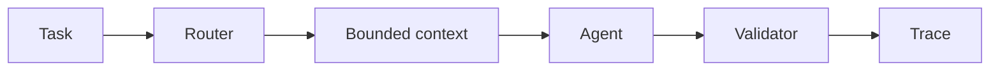

# Agentic engineering skills

A strict-TypeScript reference harness for building observable agent workflows without a provider SDK, API key, network call, or user data.



## Quick start

```sh
npm install
npm test
npm run demo -- --task "Create a strength-training week for an intermediate athlete"
npm run evals
```

## Demo output

The demo prints `classification`, `route`, `context`, `output`, `validation`, and `final trace`. The planner task deterministically routes to `planner-agent`.

## How it works

- Router uses documented transparent keywords and returns a machine-readable reason.
- Context uses exactly objective, constraints, evidence, state, and budget.
- Validator accepts only structured planner, reviewer, or explicit unsupported output.
- Golden cases test planner success, reviewer success, and invalid-output escalation through public `runHarness` API.

## Design decisions and limits

This is a reference harness, not an autonomous production agent. It intentionally has no model provider, persistence, hidden intent inference, background workers, or access to arbitrary task history. Invalid output gets one retry, then an explanatory escalation trace.

## Security and privacy

Default commands make no network calls and read no `.env` file. `npm run audit:public` scans publishable text for common secret markers, private URLs, source-project identifiers, and transcript/log artifacts; it prints only filenames and rules, never matched values.

## Advanced tooling

Core works with Node.js 20+ alone. Optional swarm, Git worktree, GitHub CLI, browser, Graphviz, and Knip integrations are documented in [advanced tooling](docs/advanced-tooling.md). Knip findings always require human review.

## Roadmap

Add provider adapters behind explicit interfaces, richer policy checks, and externally reproducible evaluation fixtures while keeping deterministic core behavior intact.
