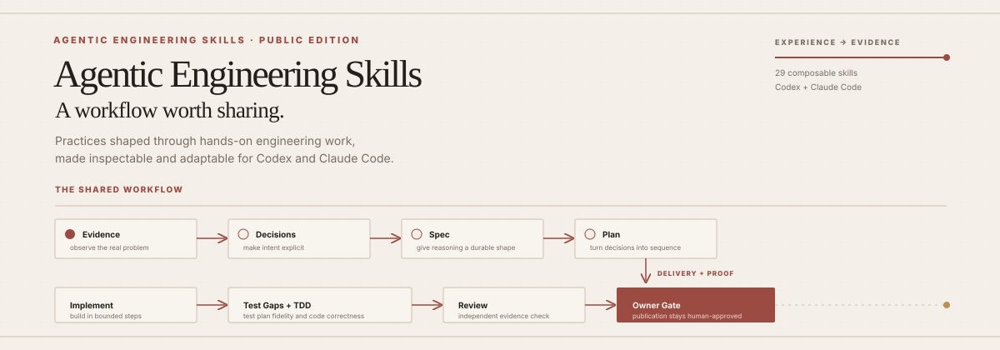
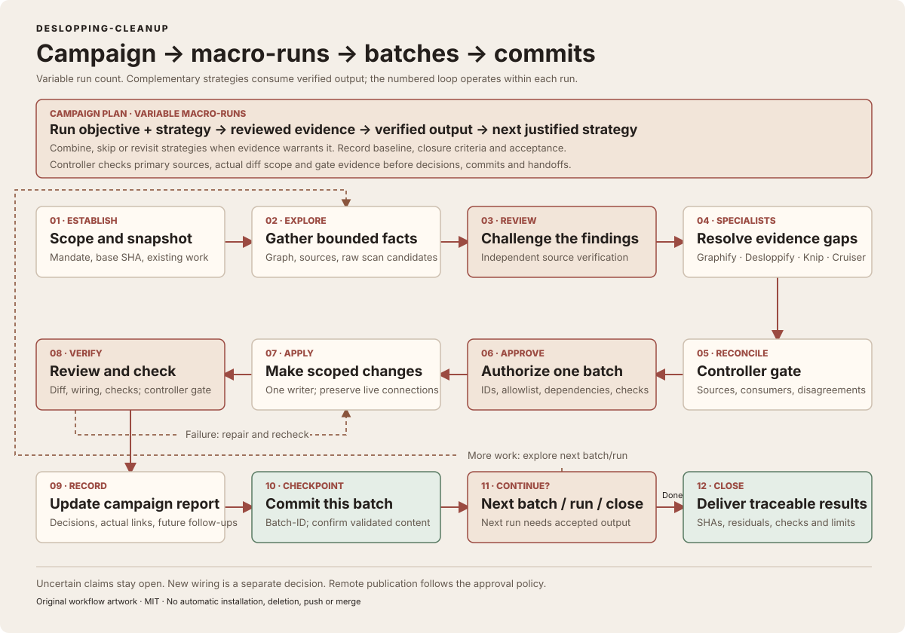
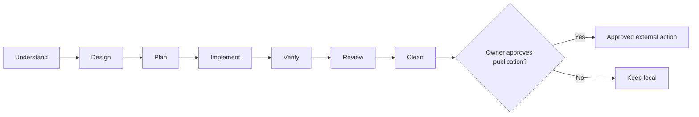

# Agentic Engineering Skills



I share this experience-shaped workflow from hands-on engineering work so others can inspect, adapt, and reuse it.

## What this repository shares

This repository is an experience-shaped collection of composable skills and agent profiles for Codex and Claude Code. It makes reasoning, sequencing, verification, and ownership visible enough to inspect and adapt in another project; it is a working practice, not a course or universal prescription.

## My working philosophy

I start from evidence instead of an implementation guess, then turn decisions into durable specifications and traceable plans. I isolate implementation work, keep worker output separate from independent evidence, and use two quality dimensions: whether delivery remains faithful to its plan and whether implemented behavior is correct. Publication and other external actions stay under explicit owner control; a plan or passing test suite does not grant publication permission.

Vendor files remain byte-exact, adaptations stay auditable, and repository-original files use this repository's MIT license. [Workflow philosophy](docs/philosophy.md) records lifecycle gates, handoff evidence, optional-tool fallbacks, and human authority boundaries.

## How I use the workflow

These are composable choices, not mandatory stages for every task.

| Situation | Path | Purpose |
| --- | --- | --- |
| Large, uncertain initiative | `Wayfinder` | Map scope that reaches beyond one session. |
| Bounded or creative design | `Brainstorming` | Clarify intent before changes. |
| Consequential or disputed design | `Grill-me` | Pressure-test assumptions. |
| Agreed design | `To Spec` | Create standalone specification. |
| Multi-step implementation | `Writing Plans` | Create traceable implementation plan. |
| Large implementation | `Sequential Task Orchestrator` | Run one bounded task at a time with review. |
| Small implementation | `Codex Implement` | Execute focused change with relevant verification. |
| Claude Code implementation | `Claude Implement` | Use host-equivalent bounded workflow. |
| Repository cleanup across responsibilities | `Deslopping Cleanup` | Investigate candidates, review evidence, and commit verified cleanup batches. |

See [workflow guide](docs/workflow.md) for routing detail and [agent profile guide](docs/agent-profiles.md) for delegation contracts.

## The quality loop

For ordered work, `Test Gaps` checks plan fidelity: it compares delivery with plan and finds missing or incomplete coverage. `Test-Driven Development` checks implementation correctness through failing tests, implementation, and passing tests. Findings return through the TDD fix cycle before acceptance, then independent evidence informs review.

## Supporting skills

I use `Impeccable` and `UI UX Pro Max` for frontend craft and design support, `Caveman` to compress communication and save tokens without losing technical substance, and `How to Use Codex` for current official guidance on model-aware prompting, settings, and delegation. `Cleaning Repo with Knip` keeps the repository lean through verified cleanup, reviewable branches, and a durable false-positive record instead of blind deletion. `Improve Codebase Architecture` helps me identify where modules lack depth or locality, so I can choose focused refactors that improve leverage and testability. `Orientated E2E Testing v5.2` is my bounded end-to-end testing and debugging route: it confirms one observable product trajectory and traverses it one Behavioral Node at a time. It keeps real effects isolated, evidence-backed, and reviewable, with deterministic pauses instead of broad audits or guessed repairs. `Merge Verified PR and Cleanup` closes out a reviewed pull request only after its current head passes required checks, then removes only the verified, unused branch and worktree.

## Example: choosing a route

### Deslopping Cleanup

[`deslopping-cleanup`](plugins/agentic-engineering-skills/skills/deslopping-cleanup/SKILL.md)
coordinates behavior-preserving repository cleanup as a campaign of macro-runs,
coherent batches and recoverable commits. Run count and strategy order follow
evidence gaps: each cumulative run consumes the preceding verified output and
answers a complementary question. Explorers gather facts; independent reviewers
challenge them; the controller directly checks decisive source claims, consumer
links, diff scope and gate evidence before approving the technical conclusions. Before batch approval, every proposed file/action receives its own rationale, evidence, expected wiring impact and uncertainty in the run report. Each verified batch updates a cumulative report of
removed, retained and deferred components and their actual or intended connections,
then receives its own local commit before the next batch starts. The campaign
report records run baselines, closure/acceptance criteria, controller verdicts and
handoffs; new residuals can justify another run without prescribing a fixed count.

The skill also helps determine whether a component is superseded, belongs to an
older implementation, or still serves a current or planned responsibility. It
combines semantic inference with source and history checks, actual consumers,
replacement behavior, compatibility requirements and intended functionality.
Before classifying disconnected components, it asks the owner which reference
documents describe that intent and which are authoritative and current, then
compares them with actual wiring. This adds context to static findings and makes
removal, retention and deferral proposals more precise and easier to judge.

An older name or a newer alternative alone does not establish obsolescence;
disconnected code may be a new feature deliberately awaiting integration.
Unresolved intent remains deferred rather than being presented as safe to remove.

Removals need at least two independent kinds of evidence, such as static analysis,
reference search, history, flow tracing or runtime observation, and no unresolved
counterproof. After discovery, the campaign can continue with branch integration
(conflict inventory, per-area decisions, completeness and semantic-conflict
checks), operational residue (configuration, stored data, external artifacts and
deployments, each non-file action separately approved) and workspace closure
(inventory of unique work, including ignored files, before any deletion).



Specialists remain distinct. `cleaning-repo-with-knip` is included; Graphify,
Desloppify, Dependency Cruiser and the named dispatch/review skills are optional
external capabilities, with explicit fallbacks. The bundle does not install them
or load them automatically. See [availability and license review](docs/deslopping-cleanup.md)
and the skill's [specialist routing](plugins/agentic-engineering-skills/skills/deslopping-cleanup/references/specialist-routing.md).

### Implementation routes

The diagram below shows the shared lifecycle. In practice, I choose the entry
point and implementation path according to scope and uncertainty.

For a large change spanning multiple modules, I map the uncertainty with
`Wayfinder`, formalize the agreed design, and use `Sequential Task Orchestrator`
to execute the plan through bounded tasks and review cycles.

For a small, well-understood change, I skip the broad discovery path and use
`Codex Implement` directly, retaining the relevant TDD, verification, review,
and owner-approval gates.

## Workflow at a glance

This diagram is the canonical overview of the workflow lifecycle.


```mermaid
flowchart LR
  U[Understand] --> D[Design]
  D --> P[Plan]
  P --> I[Implement]
  I --> V[Verify]
  V --> R[Review]
  R --> C[Clean]
  C --> A{Owner approves publication?}
  A -->|Yes| X[Approved external action]
  A -->|No| L[Keep local]
```

## Install

Install complete bundle. This is supported path.

Codex:

```text
codex plugin marketplace add GiuseppeVe/agentic-engineering-skills
codex plugin add agentic-engineering-skills@agentic-engineering-skills
```

Claude Code:

```text
claude plugin marketplace add GiuseppeVe/agentic-engineering-skills
claude plugin install agentic-engineering-skills@agentic-engineering-skills
```

Confirm discovery with `codex plugin list --available --json` or `claude plugin list`. Then start a fresh host session and invoke one included skill, such as `brainstorming`; plugin listing alone does not prove fresh-session invocation.

Selective copying is advanced and can remove workflow stages. See [selective installation](docs/selective-install.md).

## Customize

Fork repository and edit source files, never generated plugin cache. Full workflow: [customization guide](docs/customization.md).

## Compatibility

Bundle targets exactly two verified hosts: Codex and Claude Code. Release-specific validation evidence belongs in `docs/release-report.md`. See [compatibility](docs/compatibility.md).

## Provenance

Every skill is classified as `vendor`, `adapted`, or `original`, with hashes and pinned revisions in lock. See [provenance inventory](docs/provenance.md).

## License

Repository-original material: [MIT](LICENSE), copyright GiuseppeVe. Third-party material remains under applicable retained licenses; see [Third-Party Notices](THIRD_PARTY_NOTICES.md). Forking, editing, removal, and redistribution remain subject to those licenses.
