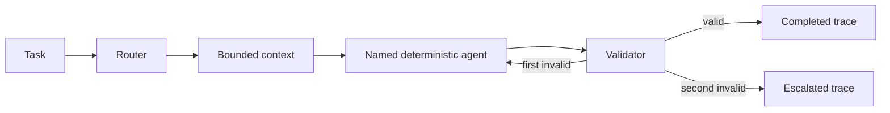

# Architecture

`runHarness` is public core. It classifies text, chooses a named deterministic agent, constructs a five-field context envelope, validates agent output, retries a recoverable invalid response once, then either completes or escalates.

Agents receive only `objective`, `constraints`, `evidence`, `state`, and `budget`. Provider adapters are deliberately outside this reference path.
