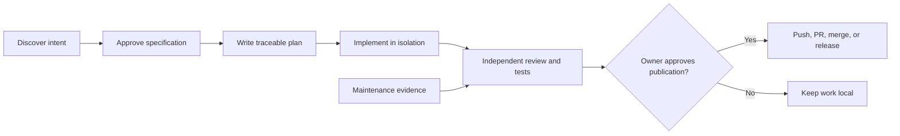
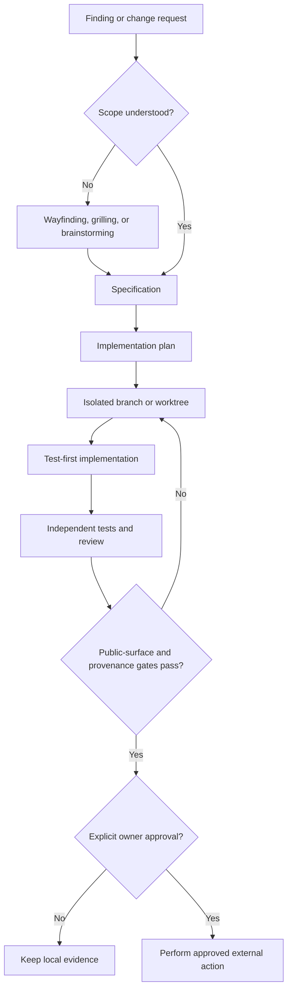

# Agentic Engineering Workflow Philosophy

This repository uses a documentation-first, host-neutral operating model. Work moves from evidence to explicit decisions, durable artifacts, isolated implementation, independent evidence, and only then an owner-approved publication action. The sequence is a disciplined default, not a substitute for project-specific judgment.

## Discover before deciding

Start with evidence, not an implementation guess. Use wayfinding when scope or architecture is broad and uncertain, grilling when consequential design intent needs pressure-testing, and brainstorming for smaller design questions. Discovery ends when decisions, constraints, success criteria, and unresolved questions are explicit.

## Preserve intent in durable artifacts

Convert an approved design into a standalone specification, then a requirement-traceable implementation plan. A specification records why, scope, and success criteria. A plan records how, ownership, tests, and review evidence. Neither artifact grants permission to publish.

## Isolate implementation and separate evidence

Implement on a dedicated branch or worktree and keep file ownership explicit. Separate controller, planner, implementer, reviewer, test-runner, researcher, and cleanup responsibilities when the task warrants delegation. An implementation context cannot certify its own blind spots: independent review and tests provide distinct evidence.

## Validate behavior, fidelity, and public surface

Tests validate observable behavior. Reviews compare the result with requirements, repository rules, and public-safety constraints. A frontend handoff import additionally needs a runnable immutable reference, complete observable contract, identical reference/candidate matrix, and explicit treatment of boundary deviations. Before release, scan public artifacts for secrets, private data, internal names, logs, and temporary residue. Verify provenance before copied or adapted third-party material enters the repository.

## Treat maintenance as research-led change

Static-analysis results, including Knip findings, are evidence rather than deletion authority. First investigate whether a reported item is a dynamic entry point, public API, generated surface, or genuine dead code. Removal requires a scoped decision, an explicit owner, and verification after the change.

## Keep advanced tools optional and honest

Core work must remain possible without a particular host, provider credential, or integration. Never claim that an unavailable capability ran.

| Optional capability | Prerequisite | Benefit | Manual fallback |
| --- | --- | --- | --- |
| Swarm orchestration | Compatible multi-agent runtime | Parallel bounded roles | Run the same roles sequentially and record each result |
| Git worktrees | Git worktree support | Checkout isolation | Use a dedicated branch in a separate clone |
| GitHub CLI | Authenticated `gh` installation | PR and check automation | Use the GitHub web interface or provide local review evidence |
| Browser capability | Supported browser integration | Rendered-surface verification | Inspect generated files and links locally |
| Graphviz | Graphviz executable | Render graph artifacts | Keep Mermaid or text diagrams as source |
| Knip | Compatible JavaScript project and Knip install | Static maintenance evidence | Inspect imports, entry points, exports, and package usage manually |

## Keep publication human-approved

Push, PR creation, merge, repository visibility changes, and release are separate external-state actions. Perform each only after validation and explicit owner approval for that action. A branch, passing suite, or review-ready PR is evidence—not permission to publish or merge.

## Handoff evidence

Each handoff should state the decision or requirement being advanced, the durable artifact that records it, the verification performed, known limitations, and the next action requiring authority. Teams may customize terminology and tooling, but retain explicit decisions, durable artifacts, independent evidence, provenance checks, and human control of external state.

## Related Work

- [Workflow guide](workflow.md) — phase-to-skill routing.
- [Provenance guide](provenance.md) — import gate and license discipline.
- [Agent profiles](agent-profiles.md) — public role contracts.
- [Release checklist](release-checklist.md) — verification and publication controls.
- [Customization guide](customization.md) — safe local tailoring.

Return to [README](../README.md).
