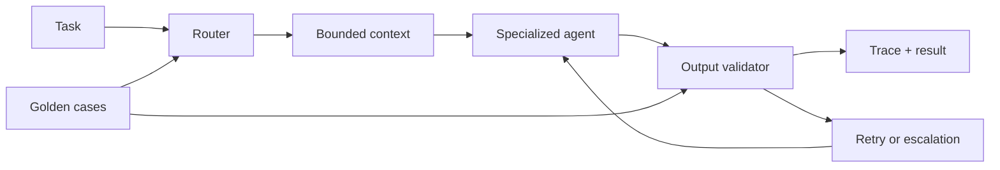

# Agentic Harness Workflow Spec

> **For agentic workers:** This `.mdx` spec is the source of truth. Preserve the `## Related Work` links when creating plans or tickets from it.

**Goal:** Provide a public, locally runnable TypeScript reference for designing, validating, evaluating, and observing specialized-agent workflows.

**Status:** Ready for planning

---

## Problem Statement

Agent workflows often hide critical decisions inside a single broad prompt: task selection is implicit, context grows without a boundary, outputs are consumed without validation, and regressions are found only after a provider-backed run. Engineers need a compact reference implementation that makes those decisions explicit and testable without requiring credentials or user data.

The repository must also show how a disciplined engineering workflow scales beyond one chat: large design work is decomposed, specifications are reviewable artifacts, implementation plans constrain execution, and specialized workers provide independent evidence during implementation and maintenance.

## Related Work

None. This is a new standalone repository. It will feed a detailed implementation plan.

## Solution

Build `agentic-harness-workflow` as a local-first Node.js and strict TypeScript project. Its default CLI uses deterministic mock agents and demonstrates task classification, explicit routing, a bounded context envelope, structured output validation, limited retry or escalation, observable traces, and golden-case evaluation.

The repository also ships a provenance-aware workflow skill pack and host-neutral agent profiles. These artifacts explain a complete engineering lifecycle while the executable demo stays independent of provider credentials, remote repositories, and user data.

## User Stories

1. As an AI engineer, I want to run a deterministic agent harness locally, so that I can inspect routing and validation without an API key.
2. As a software engineer, I want each task to route to a named specialized agent, so that responsibilities are explicit rather than buried in a generic prompt.
3. As a reviewer, I want the context passed to a worker to contain objective, constraints, evidence, state, and budget, so that context growth is visible and bounded.
4. As a maintainer, I want invalid structured output to stop downstream processing, so that malformed results cannot silently propagate.
5. As an evaluator, I want stable golden cases, so that router and validator regressions are detected without model variance.
6. As an observer, I want a final trace containing route, agent, validation outcome, retries, escalation, and reason, so that failures are explainable.
7. As a developer with a large migration or refactor, I want a wayfinding workflow, so that design uncertainty becomes a small ticket map rather than one oversized session.
8. As a developer with a detailed architecture in mind, I want a high-fidelity grilling workflow, so that the implementation agent receives precise design intent.
9. As a developer with a bounded design problem, I want lighter brainstorming, so that design work remains proportional to complexity.
10. As a developer, I want approved design material converted to a reviewable `.mdx` specification and then a detailed implementation plan, so that execution has a durable and precise source of truth.
11. As a team using multi-agent execution, I want independent implementation, review, test, and fidelity roles, so that a single context does not self-certify its own work.
12. As a maintainer, I want deterministic Knip findings verified by a researcher before cleanup, so that dynamic entrypoints and legitimate dependencies are not removed blindly.
13. As an architecture owner, I want periodic architecture analysis with optional diagrams, so that maintainability and AI navigability improve over time.
14. As a public repository user, I want all vendored skill material to have clear provenance and licensing, so that reuse is legitimate and auditable.

## Workflow Decisions

### Design workflow

Large, uncertain work such as migrations, extensive refactors, and substantial architecture design starts with `wayfinder`. It creates a ticket map that breaks planning into bounded decision phases and protects design context from uncontrolled growth.

Medium or small work, including a ticket selected from a map, then uses one of two discovery modes:

- `grill-me` for detailed, non-trivial architecture where maximum adherence to the developer's intent matters.
- `brainstorming` for lower-complexity design where a lighter exploration is sufficient.

After discovery, `to-spec` writes the design as a standalone `.mdx` specification. `writing-plans` converts the approved specification into a technical implementation plan. `implementing-plans` receives that plan path and coordinates implementation, independent review/testing, fidelity review, and an implementation report. PR, merge, and push remain explicit, cautious end steps rather than automatic publication.

### Maintenance workflow

`cleaning-repo-with-knip` starts with deterministic static findings. A researcher examines real codebase evidence before any cleanup is proposed, then produces a human-reviewable report.

`improve-codebase-architecture` examines dependency friction, module organization, and architectural depth. Its purpose is both conventional maintainability and a codebase that is easier for AI workers to navigate accurately.

## Agent Decisions

The repository exposes seven host-neutral profiles:

| Profile | Responsibility |
| --- | --- |
| `controller` | Own routing, state, budget, retry, escalation, and trace assembly. |
| `planner` | Produce a bounded structured plan. |
| `implementer` | Apply one owned task using test-first discipline. |
| `reviewer` | Assess `spec`, `quality`, `security`, or `fidelity` evidence. |
| `test-runner` | Execute and interpret named verification commands. |
| `researcher` | Gather codebase evidence and verify maintenance findings. |
| `cleanup` | Remove explicitly scoped temporary artifacts only. |

Profiles use a contract of input schema, allowed actions, output schema, validation rule, and failure path. The controller is an orchestrator, not a general-purpose worker.

## Implementation Decisions

- The core is strict TypeScript on Node.js with minimal dependencies.
- The main executable path uses deterministic mock agents. Optional provider adapters are separate from the demo.
- The harness models explicit task classification, routing, a context envelope, structured result schemas, validation, retry limits, escalation, and trace events.
- The public workflow skill pack uses source-pinned upstream material only where licensing allows it. Modified or original material states provenance and preserves notices. Unlicensed material is independently rewritten.
- `to-spec` writes local `.mdx` files by default. GitHub issue publication is an optional integration, not a core runtime requirement.
- `knip` is a development dependency and maintenance tool. Its output is evidence for review, never automatic deletion authority.

### Advanced tooling

Advanced capabilities are included and documented because they improve real-repository workflows:

| Capability | Purpose | Upgrade when available |
| --- | --- | --- |
| Swarm orchestration | Coordinate specialized independent workers. | Parallel implementation plus independent review and fidelity evidence. |
| Git worktrees | Isolate implementation from the current checkout. | Safer changes, clean rollback, and reviewable branches. |
| GitHub CLI (`gh`) | Complete delivery after approval. | Guided issue, PR, push, and merge operations. |
| Browser capability | Present architecture findings visually. | Navigable HTML reports and diagrams. |
| Graphviz | Render DOT diagrams. | Reproducible SVG architecture diagrams. |
| Knip | Produce deterministic maintenance findings. | Dead-code and dependency analysis before human-approved cleanup. |

The local demo never claims that an unavailable advanced capability ran. Advanced workflows surface their required capability before attempting that stage.

## Testing Decisions

- Router tests prove representative task classification and explicit agent selection.
- Validator tests prove valid output acceptance and invalid output rejection with reasons.
- At least three golden cases exercise successful planning, review routing, and an escalation path.
- CLI integration testing captures required demonstration fields: classification, route, context, output, validation, and final trace.
- Build, test, lint, and formatting checks run locally and in GitHub Actions.
- Knip parsing uses fixtures so maintenance behavior remains deterministic across supported output shapes.
- Tests assert observable behavior and typed contracts, not private implementation details.

## Security and Privacy Decisions

- The default demo uses no API key and stores no user data.
- Example tasks are generic. Fitness language is only a minimal task example and never a product domain.
- The repository excludes proprietary source-project material, secrets, private URLs, personal data, internal names, and logs.
- `.env.example` documents optional configuration names without values.
- Provider integrations are optional and do not run during tests or the default demo.

## Out of Scope

- A production-ready multi-provider agent framework.
- Hosting, deployment, account management, persistence, or a real fitness product.
- Automatic deletion based only on Knip output.
- Automatic remote repository creation or publication.
- Pretending a swarm, browser, Graphviz, `gh`, or worktree capability executed when it was unavailable.

## Further Notes

The README must present the problem, architecture, local quick start, a sample trace, design trade-offs, limits, security/privacy posture, and an honest roadmap. The repository root uses MIT for original material; third-party notices and license files make external skill provenance explicit.
