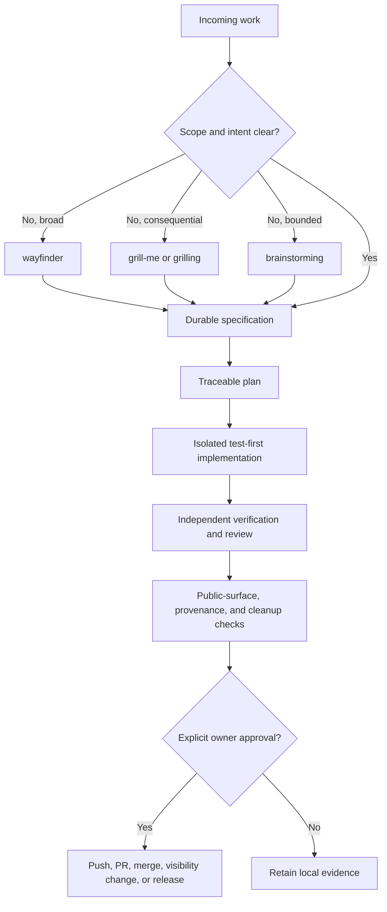

# Workflow

Seven phases form a composable path. Not every skill runs on every task; choose only skills matching risk and scope. The [workflow philosophy](philosophy.md) defines decision gates, required evidence, optional-tool fallbacks, and owner authority over publication.

This guide is the relevant-stage backlink and conditional routing surface for every included public skill. Each skill appears under the phase where it can contribute; its presence is an option, not a mandate. Select it only when task scope, risk, and the philosophy's evidence gates justify that route.

## Understand

`learn-codebase` builds broad project context. `brainstorming` clarifies intent before creative changes. `grill-me` and `grilling` pressure-test uncertain proposals. `caveman` keeps collaboration compact; `cavecrew` helps route focused investigation.

## Design

`domain-modeling` sharpens vocabulary and boundaries. `codebase-design` deepens module interfaces. `improve-codebase-architecture` finds structural opportunities. `setup-matt-pocock-skills` prepares supporting project conventions when those engineering skills need them.

## Plan

`wayfinder` maps work larger than one session. `to-spec` captures agreed behavior. `writing-plans` turns requirements into testable implementation tasks.

## Implement

`using-git-worktrees` isolates changes. `test-driven-development` drives red-green-refactor. `implementing-plans` executes written plans, while `swarm-orchestration` coordinates independent multi-agent work when scope warrants it.

## Verify

`test-driven-development` requires observed failing tests before implementation and passing tests afterward. `writing-skills` includes methods for exercising skill behavior, not only validating Markdown shape.

## Review

`implementing-plans` includes fidelity and integrated review gates. `grill-me` or `grilling` can challenge consequential design decisions before publication.

## Clean

`cleaning-repo-with-knip` removes verified dead code and records false positives. `implementing-plans` also checks temporary artifacts and debug residue before delivery.

## Routing and evidence gates

Optional integrations strengthen these stages but never become hidden dependencies. If orchestration, worktrees, GitHub CLI, browser tooling, Graphviz, or Knip is unavailable, use the documented manual fallback in the [workflow philosophy](philosophy.md) and report what actually ran.

## Phase-to-profile mapping

Profiles are optional role contracts consumed by workflow skills. They do not make this workflow an executable harness. Exact responsibilities and result envelope: [agent profile guide](agent-profiles.md).

| Profile | Workflow phase | Wiring |
| --- | --- | --- |
| `cleanup` | Clean | Removes only explicitly scoped temporary artifacts after verification and review. |
| `controller` | Cross-phase | Routes bounded work, manages retry and escalation, and assembles trace evidence. |
| `implementer` | Implement | Owns one planned task and returns test-first change evidence. |
| `planner` | Design, Plan | Converts findings and requirements into bounded tasks and acceptance criteria. |
| `researcher` | Understand, Design | Collects read-only evidence before planning or consequential decisions. |
| `reviewer` | Design, Plan, Review | Applies independent spec, quality, security, or fidelity lenses. |
| `test-runner` | Verify | Runs named commands and reports results without modifying implementation. |

Return to [README](../README.md).
