# Cleaning a Repo with Knip

## Overview

`knip` finds unused files, dependencies, exports, types, and unlisted/missing
imports. It is fast and deterministic — but **deterministic ≠ correct**. Knip does
static analysis, so it false-positives on dynamic `require`/`import()`, reflection,
string-keyed registries, framework entrypoints (routes, workers, models loaded by
side effect), and monorepo edges.

This skill is an **orchestration runbook**: it wraps knip in a
**filter → verify → clean → re-study → report → suppress** loop so confirmed-dead
code gets deleted on a branch behind verification, uncertain claims get a second
pass, and false positives land in a durable ledger that future runs honor. The
point is not that you would otherwise be reckless — it is that this packages the
whole pass (parallel verification, the UNCERTAIN loop, the FP sync) so you run it
the same safe way every time without re-deriving it.

## When to Use

- Cleaning dead code / unused deps / unused exports a repo has accumulated.
- A knip run returns many findings (dozens to 100+) and per-claim manual triage
  doesn't scale.
- You keep re-seeing the same false positives every run and want them suppressed
  durably.

**When NOT to use:** a handful of obvious findings you can verify and delete in two
minutes — just do it. This runbook earns its cost at volume or when you want a
reviewable, repeatable cleanup with a false-positive ledger.

## Core Principle

**No knip claim is deleted until a verifier confirms it real, and nothing is
deleted off the working branch.** Every false positive becomes a config rule, not
a memory.

## Environment Prerequisites

- `knip` installed and runnable (`npx knip --reporter json`).
- Knip config located: a root `knip.json`/`knip.ts`, OR per-workspace configs
  (`<ws>/knip.json`). Monorepos may need `npx knip -W` or one run per workspace.
- Verification commands known (typecheck / lint / test / build). Find them in
  `package.json` scripts before starting.
- Subagents: this runbook fans out to `ruflo-core:researcher` (verify),
  `ruflo-core:reviewer` (cross-check), `ruflo-core:coder` (apply edits) via the
  Agent tool. Substitute `general-purpose` if those types are unavailable.

## Pipeline

```dot
digraph knip {
  rankdir=LR;
  sync   [label="1 sync FP\n.md <-> knip.json"];
  run    [label="2 run knip\n+ pre-filter"];
  verify [label="3 verify L1\n(parallel researchers)"];
  clean  [label="4 clean TRUE\n(branch+approve+verify)"];
  restudy[label="5 re-study L2\nUNCERTAIN"];
  report [label="6 report"];
  resolve[label="7 resolve FP\n.md + knip.json"];
  done   [label="8 finalize\n(no auto-merge)"];
  sync->run->verify->clean->restudy->report->resolve->done;
  clean->restudy [label="revert->UNCERTAIN" style=dashed];
  restudy->clean [label="confirmed TRUE" style=dashed];
}
```



### 1. Sync the false-positive filter

Read `Knip_false_positives.md` (repo root). Ensure **every** entry has a matching
ignore rule in the config that owns its workspace. Reconcile drift **both**
directions, with this winner policy: ledger entry missing its rule → **add the rule**;
config rule missing its ledger entry → **add the ledger entry** (the config is the
source of truth, the ledger documents it); never silently delete a rule. Report all
mismatches. Create the config if missing.

**Where the rule lives (monorepo):** if a per-workspace `<ws>/knip.json` exists, the
rule goes there as a bare field (`ignore`, `ignoreDependencies`, `ignoreBinaries`).
Only a single root config uses the `workspaces.<name>.<field>` form. Pin the option
names to the workspace's knip **major** (v5 ≠ v6 — some options were renamed). The
`.md` is the human-reviewable mirror; the config is the real, durable suppression sink.

### 2. Run knip + pre-filter

```bash
npx knip --reporter json | node .claude/skills/cleaning-repo-with-knip/parse-knip.mjs --fp Knip_false_positives.md
```

(monorepo without a root config: run per workspace, e.g. `cd backend && npx knip --reporter json`.)
This buckets claims by type and drops anything already in the FP ledger. A knip run
failure (config/parse error) **aborts that workspace** before any verification —
in a monorepo, a failing workspace doesn't block the workspaces that parsed cleanly.

### 3. Verify — loop 1 (parallel)

Fan out `ruflo-core:researcher` over claim batches **in parallel** (see
**REQUIRED SUB-SKILL:** superpowers:dispatching-parallel-agents). Each claim gets a
verdict per the contract below. Dispatch template:

> You are verifying knip dead-code claims. For EACH claim, decide
> `TRUE` (genuinely unused, safe to remove) | `UNCERTAIN` | `FALSE_POSITIVE`.
> Check real usages: `git grep` the symbol/file/dep, AND check dynamic patterns —
> `require(<computed>)`, `import(...)`, string-keyed registries, reflection, config
> references, framework entrypoints (routes/workers/models loaded by side effect),
> package `exports`/`main`, and external consumers. A grep with zero static hits is
> NOT enough to call something TRUE if a dynamic-load pattern is present.
> Return ONLY JSON matching: {schema}. Claims: {batch}

**Routing the verdicts:**
- `TRUE` with `confidence < 0.8` → treat as `UNCERTAIN` (route to loop 2). A real-but-
  shaky removal earns the cross-check; only confident TRUEs enter cleanup directly.
- Two parallel researchers disagree on a claim → `UNCERTAIN` (loop 2 breaks the tie).
- `unlisted-dependency` / `unresolved-import` claims are **not removals** — they are
  *report-only* (`action: report`). Surface them in step 6; fixing a missing import or
  adding a missing dep is a manual decision, never auto-applied here.

### 4. Clean the TRUE claims

1. `git switch -c chore/knip-cleanup` (never delete on `main`).
2. Confirmed TRUEs here are `action: remove` (delete file/dep) or `action: rewrite`
   (drop an unused export but keep a still-referenced symbol — don't blind-delete the
   whole function; unexport, then let knip re-flag if it's now fully dead). Group into
   a **batched plan** by type/risk.
3. **Present the plan; get user approval before deleting.**
4. `ruflo-core:coder` applies each batch.
5. After each batch run the repo's quick verify (`verify:quick` script if present;
   else typecheck + lint of the **affected** workspace) plus any test that exercises
   the touched code. **On failure, revert that batch** and downgrade its claims to
   `UNCERTAIN` with the failure as evidence.

### 5. Re-study — loop 2 (UNCERTAIN)

Every `UNCERTAIN` (from step 3 + any step-4 reverts) gets a **fresh**
`ruflo-core:researcher` PLUS a `ruflo-core:reviewer` cross-check. Confirmed `TRUE`
→ folded back into step 4 (same approval + verify gate). Still `UNCERTAIN` →
carried to the report.

### 6. Report

Present `FALSE_POSITIVE` and still-`UNCERTAIN` claims to the user with evidence.
Discuss each.

### 7. Resolve false positives

Per claim, after discussion:
- **Stays false positive** → append a structured entry to `Knip_false_positives.md`
  AND apply the `knipRule` (config field, or in-source `@public`/`knip-ignore` tag
  when no by-name field exists). (Both. The `.md` alone suppresses nothing — knip
  never reads prose.)
- **Actually real** → fold into step 4 (approval + verify gate).
- **`report`-only** (unlisted/unresolved) → hand to the user as a fix-or-ignore
  decision; this runbook neither deletes nor auto-adds it.

### 8. Finalize

Emit a diff/summary. Commit `Knip_false_positives.md` + `knip.json` changes. Leave
`chore/knip-cleanup` for user review/merge — **no auto-merge.**

## Verdict Contract (subagent return schema)

```json
{ "id": "<type> :: <target>", "type": "...", "target": "...",
  "verdict": "TRUE | UNCERTAIN | FALSE_POSITIVE",
  "action": "remove | rewrite | report | suppress",
  "confidence": 0.0,
  "evidence": "grep result / file:line / dynamic-import or entrypoint note",
  "knipRule": "ignore | ignoreDependencies | ignoreBinaries | workspaces.<name>.<field> | tag:@public | tag:knip-ignore" }
```

- `action`: `TRUE` → `remove`/`rewrite`; `FALSE_POSITIVE` → `suppress`;
  `unlisted-dependency`/`unresolved-import` → `report` (never auto-fixed).
- `knipRule` is **required** when verdict is `FALSE_POSITIVE` (step 7 writes it).
  Not every FP is expressible as a config field — a single unused **export** has no
  by-name config rule. Options, best first: an in-source tag — `/** @public */` if the
  export is a genuine public API surface, else `// knip-ignore` for internal-but-
  dynamically-referenced symbols — then a narrow config `ignore`. Flag that a
  **file-level** `ignore` is lossy — it hides any *future* dead export in that file.

## `Knip_false_positives.md` Format

Stable identity `<claim-type> :: <target>` so re-runs (and `parse-knip.mjs`) match:

```
## <claim-type> :: <path-or-symbol-or-dependency>
- knip-rule: <ignore | ignoreDependencies | ignoreBinaries | workspaces.<name>.ignore>
- reason: <why knip is wrong — dynamic import / entrypoint / reflection / external consumer>
- evidence: <grep result, file:line, or config reference>
- confirmed: <YYYY-MM-DD>
```

`target` for symbols is `<file>#<symbol>` (matches `parse-knip.mjs` output).

## Quick Reference

| Step | Actor | Gate |
|------|-------|------|
| Sync FP filter | main | `.md` ⇄ `knip.json` reconciled |
| Run + pre-filter | `parse-knip.mjs` | knip-fail → abort |
| Verify L1 | parallel `researcher` | verdict + evidence per claim |
| Clean TRUE | `coder` on branch | user approval + verify-per-batch + revert-on-fail |
| Re-study L2 | fresh `researcher` + `reviewer` | UNCERTAIN only |
| Resolve FP | main | write `.md` **and** `knip.json` |
| Finalize | main | commit config, **no auto-merge** |

## Common Mistakes

| Mistake | Why it bites | Do instead |
|---------|--------------|------------|
| Trusting a zero-grep-hit as "dead" | misses dynamic `require`/`import()`, reflection, entrypoints | check dynamic patterns before TRUE |
| Recording FP only in the `.md` | knip never reads prose → re-flagged forever | write the `knip.json` rule too |
| Deleting on `main` | no clean revert path | always `chore/knip-cleanup` branch |
| One big delete, verify once at end | a failure taints the whole batch | verify per batch, revert the failing one |
| Skipping the UNCERTAIN loop | borderline real-dead code never reclaimed; borderline FPs deleted | run loop 2 with reviewer cross-check |
| Auto-merging the cleanup branch | removes human review of deletions | leave the branch; user merges |

## Out of Scope

claude-flow CLI swarm; Workflow-tool fan-out; auto-merge; auto-fixing missing
imports (report them — fixing is a manual/cleanup-batch decision).
