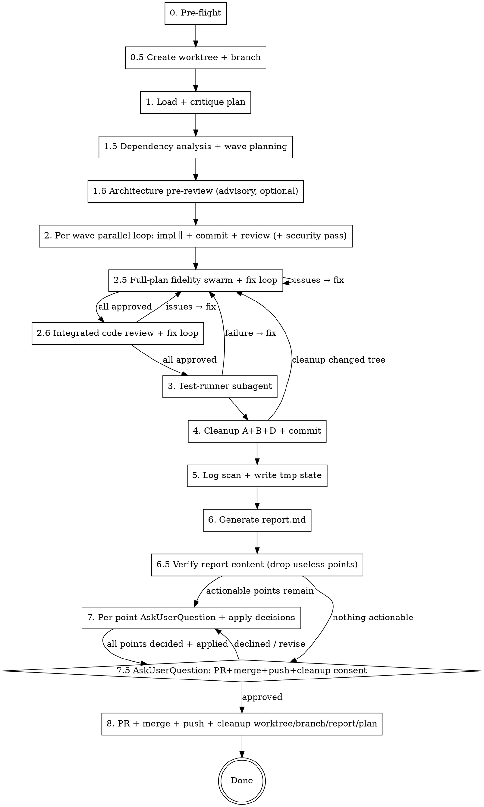

# Implementing Plans

## Overview

Autonomous end-to-end execution of a markdown implementation plan: pre-flight checks → isolated worktree + branch → wave-parallel implementation → **full-plan fidelity swarm with iterative fixes** → **integrated code review** → full tests → cleanup → report decisions → authorization gate → PR, merge, push, and artifact cleanup.

**Announce at start:** "I'm using the implementing-plans skill to execute this plan."

**Core principle:** Every phase is enforced. Task-level approval is not proof that the integrated branch implements the complete plan. Publication is allowed only after full-plan fidelity, integrated code review, and tests are green for the same implementation content. State persists in a tmp file so multi-turn discussions do not lose context.

**Continuous execution:** Do not pause to check in between phases 0.5–6.5. Run them through to the report verification. Only stop at: BLOCKED status you cannot resolve, ambiguity that genuinely prevents progress, the per-point decisions at Phase 7, or the authorization gate at Phase 7.5.

## When to Use

- User pastes path to a plan `.md` and asks to implement it
- User says "implementa il piano X.md" / "execute this plan" / similar
- Plan has independent tasks (mostly) and subagents are available

**Do NOT use when:**
- No written plan exists yet → use `brainstorming` then `writing-plans` first
- Tasks tightly coupled (heavy shared state across tasks) → execute manually with explicit checkpoints instead of wave-parallel swarm dispatch
- User wants step-by-step approval per task → execute manually with explicit user approval after each task

## Phase Map



## Phase 0 — Pre-flight (BLOCKING)

**Codex compatibility:** Before running the checks below in Codex, read `./codex-agent-wiring.md` and resolve the Claude Code `Agent` / `subagent_type` calls through `multi_agent_v1.spawn_agent` with the copied `./agents/plan-*.md` profiles. If that wiring cannot be loaded, treat the Agent availability check as failed.

Verify ALL before any action. Each failure = stop and ask user:

| Check | Action on fail |
|---|---|
| Plan file exists at absolute path | STOP. Ask user for correct path. Do NOT synthesize spec. |
| Not on `main` / `master` / `trunk` branch | STOP. Ask explicit consent OR ask which branch to create. |
| Git working tree clean (or expected dirty noted) | STOP. Ask user how to handle uncommitted changes. |
| Repo has test command (package.json scripts.test / Makefile test / pytest config / etc.) | STOP. Ask user how to run tests. |
| `git rev-parse --git-dir` returns a shell-resolvable path | STOP. On Windows+WSL, a `.git` file pointing to `//wsl.localhost/...` (UNC) breaks git-bash. Suggest: run from PowerShell, move repo to native Linux path, or use `GIT_DIR`/`GIT_WORK_TREE` env overrides. |
| `git worktree list` includes current worktree (when inside one) | STOP if orphaned (metadata missing from `.git/worktrees/<name>/`). Ask user how to repair. Do NOT force-reattach or use `/tmp` workarounds. |
| `AskUserQuestion` tool available + `Agent` tool available | STOP. Skill requires both. Fall back to manual execution with explicit checkpoints, or abort. |
| All 9 specialist agents resolve (`plan-implementer`, `plan-spec-reviewer`, `plan-quality-reviewer`, `plan-combined-reviewer`, `plan-fidelity-reviewer`, `plan-integrated-quality-reviewer`, `plan-test-runner`, `plan-cleanup`, `plan-log-scanner`) | STOP. Skill requires them. Tell user to create them (see this skill's agent set) or fall back to manual execution with explicit checkpoints, or abort. |
| Advisory agents resolve (`plan-architect`, `plan-security-reviewer`) | DO NOT stop. These are OPTIONAL augmentation (Phase 1.6 + Phase 2 security pass). If either is unavailable, record it in tmp state (`advisory_agents_available`) and skip that step silently — never block the core flow on an advisory agent. |

**No exceptions to BLOCKING.** "Sandbox is throwaway" is not a reason to skip the branch check.

**Agent unavailability — HARD STOP.** If the `Agent` tool is unavailable in your environment, you MUST stop and tell the user. Do NOT simulate subagents by running implementer + reviewer + tester roles inline as the controller. Inline simulation defeats the adversarial split that makes spec-reviewer and quality-reviewer meaningful — same model in same context = same blind spots. Fall back to manual execution with explicit checkpoints (manual workflow without subagents) or abort.

## Phase 0.5 — Create Worktree + Branch (BLOCKING, MANDATORY)

Before any subagent dispatch — and before Phase 1 even reads the plan in detail — isolate the implementation in a fresh worktree on a new branch. This protects the user's source tree from in-flight changes and makes the Phase 8 PR+merge+push+cleanup atomic.

1. **Derive branch name deterministically from the plan filename slug.** Strip directory, strip `.md`, strip leading date segments (`YYYY-MM-DD-`), prefix with `impl/` → e.g. `docs/superpowers/plans/2026-05-28-foo-bar.md` → `impl/foo-bar`. Do NOT ask the user to confirm the name — the slug is canonical. Only ask if the slug collides with an existing branch (suffix `-2`, `-3`, … in that case).
2. **Create the worktree on the new branch from current HEAD of the source branch:**
   - Prefer the harness `EnterWorktree` tool when available (it manages path + lifecycle).
   - Else fall back to `git worktree add <sibling-path> -b <branch>` via `Bash`. Sibling path: `../<repo-basename>-impl-<slug>`.
3. **All subsequent phases operate inside the worktree.** Subagents are dispatched with the worktree path as cwd / repo root. The controller's own git commands target the worktree.
4. **Initialize the tmp state file** from `./state-schema.md`. Persist `worktree_path`, `branch`, `source_tree_path`, `main_branch`, and `implementation_base_sha` (`git rev-parse HEAD` before implementation commits). Phase 8 reads these values for merge synchronization and cleanup.
5. **Verify before proceeding to Phase 1:** `git worktree list` shows the new path AND `git -C <worktree> rev-parse --abbrev-ref HEAD` returns the new branch AND `git -C <worktree> status --short` is clean.

**Loophole closures:**
- "Plan is small, worktree overhead unnecessary" → MANDATORY. The worktree is what makes Phase 8 PR+merge+cleanup safe and reversible.
- "User is already on a feature branch, reuse it" → NO. Always create a fresh worktree+branch dedicated to THIS plan.
- "EnterWorktree tool is deferred / unavailable" → Use `git worktree add` via Bash. STOP only if even that fails.
- "I'll create the branch in-place without a worktree" → NO. In-place mutates the user's source tree; Phase 8 cleanup cannot then drop the workspace cleanly.

## Phase 1 — Load + Critique Plan

1. Read plan file in full.
2. Extract all tasks (full text, not summaries). Note any context section.
3. Critique. Scan for these **known-cost contradiction patterns** — surface BEFORE Phase 2 to avoid implementer + reviewer + fix-loop burn on broken specs:

   | Pattern | Symptom in spec | Suggested amendment |
   |---|---|---|
   | Negative-grep + positive-literal | `expect(src).not.toMatch(/X/)` AND spec requires call/import/type/value containing `X` in source | Assert on call-shape (`expect(src).toMatch(/funcName\(/)`) instead of literal grep |
   | Library-property mismatch | Spec asserts property X on lib instance, but installed lib version exposes Y | Assert on actual property OR call-shape, not instance shape |
   | Formatting-pinned grep | Test asserts quote style / whitespace / exact line | Loosen to `['"]X['"]` patterns or call-shape |
   | Generic | Ambiguity, missing deps, cross-task contradictions | Original generic critique |
4. **Build the Requirement Inventory (MANDATORY — controller-side, ONCE).** This is the single highest-leverage fidelity safeguard: the Phase 2.5 swarm's coverage is only trustworthy if the list of requirements it must cover is produced by the controller, not improvised by each reviewer. Enumerate EVERY atomic, independently-verifiable requirement in the plan and assign each a stable id `REQ-NNN`:
   - **(a) Checkboxes** — every `- [ ]` / `- [x]` line is at least one requirement.
   - **(b) Prose obligations** — every MUST / SHALL / REQUIRED / "has to" / "the implementation must" / "ensure that" statement in task bodies AND any context/overview section, even when NOT a checkbox. Plans written by `superpowers:writing-plans` carry obligations in prose; checkbox-only extraction misses them (this is the #1 source of "a later session found a gap").
   - **(c) Promised tests** — every test the plan explicitly says to add/keep (file or assertion).
   - **(d) Cross-task contracts** — every "A is consumed/wired/imported by B", config key, migration, or deferral target. These have no single owning checkbox and are exactly what per-task review misses.
   Record `requirement_inventory[]` in tmp state (`{id, text, source: checkbox|prose|test|contract, plan_ref}`). One requirement = one atomic checkable claim; split compound checkboxes ("do X and Y") into two ids. **Do NOT compress, summarize, or judge importance** — completeness here is what makes Phase 2.5 sound. If the plan is too vague to extract a verifiable requirement, that is a Phase 1 critique concern (step 5), not a reason to drop it.
5. If concerns → raise with user BEFORE proceeding. This is the ONLY user checkpoint between Phase 0.5 (worktree ready) and Phase 7 (per-point decisions). Once user clarifies (or you have none), proceed continuously through Phase 6.5 without further check-ins.
6. **MANDATORY:** Create `TodoWrite` with one entry per plan task + one entry per meta-phase (0.5 worktree, 2.5 full-plan fidelity, 2.6 integrated review, 3 test-runner, 4 cleanup, 5 log-scan, 6 report, 6.5 filter, 7 per-point decisions, 7.5 authorization, 8 PR+merge+cleanup). Do not skip TodoWrite for "small N" — it is the audit trail across multi-turn Phase 7.

## Phase 1.5 — Dependency Analysis + Wave Planning

Goal: parallelize ONLY what is provably safe. Build the schedule before dispatching anything.

1. **Owned-file set per task.** For each task, derive the set of files it Creates/Modifies — from the task's `Files:` block if present, else infer conservatively from the task text. Record per task.
2. **Dependency edges.** Add edge A→B when B reads/imports/extends an artifact A creates, or B's text references A's output. This orders waves.
3. **Wave grouping (greedy, plan order).** A task joins the current wave iff it has (a) no dependency edge to/from any task already in the wave AND (b) an owned-file set disjoint from every task already in the wave. Otherwise it starts a new wave.
4. **Conservatism (MANDATORY).** If a task's owned-file set cannot be predicted with confidence (dynamic/unknown paths), place it in its OWN singleton wave. Serial is always safe; a wrong disjointness guess causes a live-tree clobber. When in doubt, isolate.
5. **Concurrency cap.** Max 3 implementers per wave. If an independent set exceeds 3, split it into ordered sub-batches of ≤3 (still parallel within each sub-batch).
6. **Capture cross-task deferrals (MANDATORY).** For each task, scan the plan text for work this task *intentionally does not do* because a later task covers it. Phrases to mine: "deferred to T<N>", "covered in task <X>", "wired up in T<N+1>", "tests added in T<later>", "TODO handled by", "stub for now, T<N> replaces". Record one entry per deferral as `{description, deferred_to_task}` in tmp state under `deferrals_per_task[<task_id>]`. This list is injected into BOTH the implementer prompt (so it doesn't over-build) AND every reviewer prompt for that task (so the reviewer does not flag the absence as an ISSUE — false positives in Phase 2 are the most common source of wasted fix-loop dispatches). If a task has zero deferrals, record an empty list — explicit emptiness still signals "I checked" to the reviewer.
7. **Announce the wave plan** to the user as one line per wave, e.g. `Wave 1: [T1,T3] ∥ | Wave 2: [T2] | Wave 3: [T4,T5] ∥`. This is visibility only — NOT a checkpoint. Proceed to Phase 2 without waiting.

**Loophole closure:** "Plan doesn't use the word 'defer', so no deferrals" → NO. Re-read each task asking "does this task assume something it doesn't itself produce?". Implicit deferrals (an import that another task creates, a config key another task sets, a migration another task runs) MUST be captured the same way.

## Phase 1.6 — Architecture Pre-Review (advisory, OPTIONAL)

Independent design check before any code is written. Skipped silently if `plan-architect` is unavailable (see Phase 0 advisory-agent row). This is advisory — it does NOT add a user checkpoint and does NOT block, except when it returns a CRITICAL finding.

1. **Skip conditions.** If `plan-architect` did not resolve in Phase 0, OR the plan has a single trivial task, skip directly to Phase 2 (note `architecture_review: skipped` in tmp state). Do not announce skips for trivial plans.
2. **Dispatch once.** Single `Agent` call, `subagent_type: plan-architect`, prompt from `./architect-prompt.md`, carrying `{{PLAN_TEXT}}` (the text already loaded in Phase 1 — do NOT make the subagent re-read the file) + `{{REPO_ABS_PATH}}` + `{{OWNED_FILE_SETS}}` + `{{WAVE_PLAN}}` from Phase 1.5. Read-only; never backgrounded — its result may change wave planning.
3. **Fold the result (controller decides — the architect is advisory, not authoritative):**
   - **Wave-planning notes** → re-run the Phase 1.5 disjointness check for any flagged task pair. If a pair the plan treated as parallel actually shares a contract/file/migration, MOVE them into different waves (serial). This is the highest-value output of this phase — a corrected wave plan prevents a live-tree clobber.
   - **CRITICAL** findings → treat as a Phase 1 critique result: surface to the user as a checkpoint BEFORE Phase 2 (this is the same checkpoint class as Phase 1 step 4). Do not silently amend the plan on the architect's say-so.
   - **ADVISORY** findings → record in tmp state `architecture_advisory[]` for the Phase 6 report; do NOT act on them mid-flight (they are not in any task's spec).
4. **Persist:** write the architect's structured result + any wave-plan changes to tmp state (`architecture_review`). Update `TodoWrite` for the 1.6 meta-phase.

**Loophole closures:**
- "Architect is advisory, so I can skip folding the wave-planning notes" → NO. Advisory applies to design *opinions*; a flagged shared-file/contract between "parallel" tasks is a correctness input to wave planning and MUST be re-checked.
- "Architect raised CRITICAL but I'll just amend the plan myself to keep momentum" → NO. CRITICAL = user checkpoint, same as Phase 1. Continuous execution resumes after the user clarifies.
- "No plan-architect agent, so the whole skill should stop" → NO. It is OPTIONAL. Skip and continue; the core plan-* pipeline is unaffected.

## Phase 2 — Per-Wave Parallel Loop (file-ownership isolation)

Execute waves from Phase 1.5 in order. Within a wave, tasks run in parallel because their owned-file sets are disjoint. The controller owns ALL git operations.

For each WAVE:

0. **Idempotency pre-check per task (MANDATORY).** For each task in the wave: `git log --oneline -20` for its expected conventional-commit subject + `git status --short` for its owned files. If commit present → mark done, drop from wave. If owned files already match spec but uncommitted → controller commits with the expected message, mark done, drop. Else → keep in wave for dispatch.

1. **Dispatch implementers in parallel.** First, **assert the owned-file sets are pairwise disjoint** (recompute the intersection across the wave's remaining tasks); if any two intersect, STOP — that is a Phase 1.5 wave-planning bug, not something to dispatch through. Then, in a SINGLE message, emit one `Agent` call per remaining task, `subagent_type: plan-implementer`, each prompt (from `./implementer-prompt.md`) carrying its FULL task text + its `{{OWNED_FILES}}` list + its `{{DEFERRALS_FOR_THIS_TASK}}` block from Phase 1.5 + repo/branch/test commands. Implementers write ONLY owned files, do NOT build the deferred items (those are covered by later tasks), run TDD, and do NOT run git. (Singleton wave → one dispatch.) Do NOT background implementers — their results gate commits.

2. **Collect results.** `NEEDS_CONTEXT` → answer, re-dispatch that one. `BLOCKED` you can't resolve → STOP, surface to user. `DONE`/`DONE_WITH_CONCERNS` → proceed. **Ownership verification (MANDATORY before any commit):** for each DONE task, verify its reported `Files written:` ⊆ that task's owned-file set, and `git status --short` shows no non-owned path changed. If an implementer wrote outside its boundary, treat it as `BLOCKED`: do NOT commit, revert/re-scope, re-dispatch. This converts a silent live-tree clobber into a failure caught before the commit.

3. **Finalize each task — ONE TASK AT A TIME (commit → review → fix).** Implementers ran in parallel (steps 1–2); the git + review cycle is serialized per task so the task under fix is always `HEAD` — required for a correct `--amend`. Do NOT commit the whole wave up front and review afterward: that leaves earlier tasks buried under later commits and `--amend` would hit the wrong one. For each DONE task in the wave, complete a–e fully before starting the next task:

   a. **Commit.** `git add <that task's owned files>` then `git commit -m "<task's conventional message>"`. Capture the SHA. This task is now `HEAD`. One commit at a time — never concurrent (avoids `.git/index.lock` races).
   b. **Review.** Dispatch `plan-spec-reviewer`; only after `APPROVED` → `plan-quality-reviewer`. (If combined-tier eligible — see below — dispatch one `plan-combined-reviewer` instead.) Pass the current commit SHA + files changed + this task's `{{DEFERRALS_FOR_THIS_TASK}}` block from Phase 1.5 (+ the task spec for the spec / combined reviewer). The deferral block is what prevents the reviewer from flagging legitimately-out-of-scope work as ISSUES. spec→quality stays strictly serial.
   c. **Fix loop.** Reviewer `ISSUES` → re-dispatch `plan-implementer` with the issue list + the SAME owned-file list (still no git) → controller folds the fix with `git commit --amend` (correct: this task is `HEAD`; safe because nothing is pushed) → re-review using the NEW post-amend SHA. Loop until spec ✅ AND quality ✅.
   d. **Read-only reviewer guard (MANDATORY).** Reviewers carry no Edit/Write tool but DO have Bash, so they *could* mutate via raw shell. After review, assert they did not: `HEAD` equals the SHA you just committed/amended AND `git status --short` is clean. If `HEAD` moved or the tree is dirty, a reviewer broke its read-only contract — STOP and surface; do not advance. (Same "verify, don't trust" guard as the implementer ownership check in step 2.)
   d.5. **Security pass (CONDITIONAL, advisory agent).** Run ONLY if `plan-security-reviewer` resolved (Phase 0) AND this task is security-sensitive. A task is security-sensitive iff its diff touches any of: authentication/authorization, untrusted input handling (parsing, SQL, shell/`exec`, eval, templating), secrets/credentials, file-path construction, server-side fetch/URLs (SSRF), crypto/hashing/token generation, deserialization, or it adds/bumps a dependency. Decide from the task spec + the committed diff. If not security-sensitive, or the agent is unavailable → skip silently. If it applies: dispatch `plan-security-reviewer` (`./security-reviewer-prompt.md`) ONLY after spec ✅ AND quality ✅, passing the current SHA + files changed + `{{SECURITY_FLAG_REASON}}` (which surface) + this task's `{{DEFERRALS_FOR_THIS_TASK}}`. `ISSUES` → same fix loop as step c (re-dispatch implementer with the security issues + SAME owned-file list → controller `--amend` → re-review spec? no, re-run quality + security on the new SHA). Loop until security ✅. Then re-run the step-d read-only guard on the post-amend SHA. Record the security verdict in tmp state `security_review[<task_id>]`.
   e. Task done. Advance to the next task in the wave (back to a).

4. **Close the wave.** Mark all wave tasks complete in `TodoWrite`. Start the NEXT wave only after the current wave is fully committed and both-✅ reviewed (the next wave may depend on it).

**Combined spec+quality reviewer (efficiency tier)** still applies per the original eligibility rules (diff <50 LoC, no SDK/lib/signature/security change) — collapse into one `plan-combined-reviewer` dispatch (it runs spec FIRST, then quality, and stops at spec if spec fails) labeled `=== SPEC ===` / `=== QUALITY ===`. Everything else: separate `plan-spec-reviewer` → `plan-quality-reviewer`.

**Chunking note.** Waves already bound context. For very large plans (>4 waves), give a one-line status after each wave ("Wave 2 done, 3 commits, advancing to Wave 3"). No checkpoint.

**Parallel implementer rule:** ALLOWED within a wave (Phase 1.5 guarantees disjoint owned-file sets). FORBIDDEN across tasks whose owned-file sets intersect — those MUST land in different waves and run serially. Never dispatch two implementers that can write the same file.

**Commit granularity:** one commit per task, authored by the CONTROLLER (not the implementer — implementers never run git, see Phase 2). Fixes within a task `--amend` that task's commit — correct because Phase 2 finalizes one task at a time, so the task under fix is always `HEAD`. The Phase 4 cleanup commit stays separate. Never bundle multiple tasks into one commit.

## Phase 2.5 — Full-Plan Fidelity Swarm (BLOCKING)

Task-level approvals cannot prove complete-plan fidelity. **REQUIRED REFERENCE:** read and follow `./validation-loop.md` before dispatch.

- **Inject the Requirement Inventory (Phase 1 step 4) into every reviewer** via `{{REQUIREMENT_INVENTORY}}`. The reviewers do NOT re-derive the requirement list — they verify the controller-supplied inventory against the candidate. This is what removes the "reviewer silently checked a partial list and approved" failure.
- Dispatch three fresh, independent `plan-fidelity-reviewer` agents in parallel: `requirements`, `integration`, and `scope-tests`.
- **Forced coverage (not free-form).** Each reviewer MUST return a verdict line for EVERY inventory id in its scope: `COVERED <file:line>` | `MISSING` | `NA-for-lens`. `APPROVED` is allowed ONLY if zero in-scope ids are `MISSING` and no unlisted findings remain. A reviewer that omits an inventory id has not approved it — the controller treats an omitted id as `MISSING`.
- **Union coverage gate (controller-side, catches cross-lens fall-through).** After all three return, assert that the UNION of the three coverage maps marks **every** `requirement_inventory[]` id as `COVERED` by at least one lens. Any id left `MISSING`/`NA` by all three = automatic block, even if each individual reviewer said APPROVED.
- **Read-only guard (MANDATORY).** After the swarm returns, assert `HEAD == candidate_sha` AND `git status --short` is clean. Reviewers carry Bash and could mutate via raw shell; if `HEAD` moved or the tree is dirty, a reviewer broke its contract → STOP and surface.
- Any substantiated issue blocks. Build disjoint remediation packets; dispatch up to three `plan-implementer` fixers in parallel, otherwise serialize.
- Commit fixes separately, then rerun the **entire three-reviewer swarm** on new `HEAD`.
- Advance only when all three approve same SHA AND the union coverage gate is satisfied. Repeated findings without progress → `BLOCKED`, never forced green.
- Persist every round, the per-round coverage maps, and `fidelity_approved_sha`.

## Phase 2.6 — Integrated Code Review (BLOCKING)

After fidelity is green, follow `./validation-loop.md`:

- Dispatch two fresh `plan-integrated-quality-reviewer` agents in parallel: `correctness-security` and `maintainability-tests`.
- `BLOCKER`/`IMPORTANT` findings trigger bounded `plan-implementer` fixes.
- **Any fix returns to Phase 2.5**, then both integrated reviewers rerun.
- Advance only when both approve same SHA. Persist `integrated_review_approved_sha`.

## Phase 3 — Test-Runner Subagent

After Phase 2.5 and 2.6 approve the same candidate, dispatch `plan-test-runner` (`./test-runner-prompt.md`) on that candidate. Test suites run serially, never in parallel. It must:

1. Run full test suite using the project's test command.
2. Run lint / typecheck if configured (read `package.json` scripts, `Makefile`, etc.).
3. Report exit codes verbatim. Do NOT mask failures with workarounds.
4. If failures → dispatch `plan-implementer` with explicit owned files and the failure evidence → commit fix → return to Phase 2.5. A test fix invalidates fidelity and integrated-review approvals.
5. On PASS, persist `validated_head_sha`, test results, and `implementation_files`. This is the publication validation receipt.

**Loophole closure:** "Tests fail on Windows but pass on Linux, I'll note it" → **NO.** Either fix or BLOCK. Silent workarounds are forbidden.

## Phase 4 — Cleanup A+B+D

Dispatch `plan-cleanup` (`./cleanup-prompt.md`). Scope is exactly:

| Class | What | Examples |
|---|---|---|
| **A** | Standalone temp test scripts in repo root or non-test dirs | `test-*.js`, `scratch-*.ts`, `try-*.py`, `repro.*` (outside `tests/`, `__tests__/`, `spec/`) |
| **B** | Files with throwaway extensions anywhere | `*.tmp`, `*.bak`, `*.scratch`, `*.swp`, `*~` |
| **D** | Files created during this implementation that are NOT in the plan's intended output | Filter via `git diff --name-status HEAD~N..HEAD` where N = task count; cross-reference plan; remove untracked-yet-created files matching A/B |

**NOT in scope of phase 4** (deferred downstream):
- Debug `console.log`/`print`/`logger.debug` in production code → these are class **C**, scanned in Phase 5, exposed as actionable points in Phase 6.5, decided per-point by the user in Phase 7 (remove / keep / follow-up). Phase 4 does NOT touch them.
- Modifications inside files that already existed pre-implementation (those go through normal code review).

**Loophole closures:**
- "User said 'temp test scripts', I'll narrow to literal scripts only" → Scope is A+B+D as defined. No narrowing.
- "Removing files needs `rm` which is denied by user permissions" → Use `git rm <path>` (tracked) or single explicit `Bash` calls per file. If still blocked, STOP and ask user to authorize, listing exact files.

After cleanup → `git add -A && git commit -m "chore: cleanup temp artifacts"`, then return to Phase 2.5 because cleanup changed the integrated tree. Proceed to Phase 5 only after cleanup reports nothing left and Phases 2.5, 2.6, and 3 are green for current implementation content.

**If nothing to clean:** skip the cleanup commit entirely. Do NOT create an empty commit. Do NOT bundle a `chore: cleanup` message onto an implementation commit. Verify all task commits already exist from Phase 2 before moving to Phase 5.

## Phase 5 — Log Scan + Tmp State File

Dispatch `plan-log-scanner` (`./log-scanner-prompt.md`). It scans **only files touched during this implementation** (per `git diff HEAD~N..HEAD --name-only`) for class-C debug statements:

- `console.log` / `console.debug` / `console.trace` in JS/TS prod files
- `print(` / `pprint(` / `breakpoint()` in Python prod files
- `dump_var`, `var_dump`, `dd(`, `dump(` (PHP/Laravel)
- `fmt.Println` outside Go test files / main entry points
- `puts` / `pp` in Ruby prod
- Custom debug logger calls if codebase has one (read CLAUDE.md/AGENTS.md hint)

**Output:** write `<worktree>/.implementing-plans-state.json` (gitignored) per schema in `./state-schema.md`. Add the path to `.gitignore` if absent. Do NOT gitignore `IMPLEMENTATION_REPORT.md` — it's a tracked artifact (Phase 8 removes it via `git rm` along with `plan.md`, after the merge).

**Loophole closure:** "Conversation context is enough, no tmp file" → **MANDATORY.** Conversation compresses, multi-turn drifts, user may resume next day. State file is source of truth.

## Phase 6 — Generate Report

Write `<worktree>/IMPLEMENTATION_REPORT.md` per template in `./report-template.md`. Update tmp state file's `report_path` field. Commit: `git add IMPLEMENTATION_REPORT.md && git commit -m "docs: implementation report for <plan title>"`.

Do NOT message the user yet — Phase 6.5 filters the report first.

## Phase 6.5 — Verify Report Content (drop useless points)

Before exposing the report to the user, the controller re-reads `IMPLEMENTATION_REPORT.md` end-to-end and filters out points that don't deserve the user's attention. A point is **useless** (and must be dropped) if any of:

- It restates a fact already obvious from `git log` / diff (e.g. "Phase 4 ran cleanup" with no actionable finding).
- It is a class-C log finding the scanner already determined is legitimate user-facing output, not debug noise.
- It is generic boilerplate with no file / line / concrete reference.
- It is a duplicate of another point (same file+line or same concern paraphrased).
- It was a `DONE_WITH_CONCERNS` note from an implementer that the reviewer subsequently APPROVED — the concern was resolved, the note is residue.

For each removed point:
- Rewrite the report in place so it contains ONLY actionable items the user must decide on.
- If the removal corresponds to a `debug_logs_found` entry, drop that entry from the tmp state file too.
- Amend the Phase 6 report commit: `git add IMPLEMENTATION_REPORT.md && git commit --amend --no-edit`.

If after filtering NO actionable points remain, set `report_actionable: false` in tmp state and skip directly to Phase 7.5 (authorization gate) with a one-line "Nothing actionable in report — proceeding to authorization." message. Otherwise set `report_actionable: true` and proceed to Phase 7.

**Do NOT skip Phase 6.5 even if the report looks clean.** The filter is what keeps Phase 7 from drowning the user in noise and what justifies the per-point UX.

**Loophole closure:** "Report has only 1–2 points, filter is overhead" → MANDATORY. The point isn't volume reduction; it's confidence that every remaining item genuinely needs a decision.

## Phase 7 — Per-point user decisions

For each remaining (filtered) point in `IMPLEMENTATION_REPORT.md`, ask the user via `AskUserQuestion` — **one point per `AskUserQuestion` call**, with full context inline. Format the question as:

- **Question body:** 2–4 sentences explaining the point — what was found, where (`file_path:line`), why it matters, what the trade-off is. Do NOT reference the report by section number alone; restate the concrete details so the user can decide without scrolling.
- **Options (3–4):** each option is one concrete action with a one-sentence motivation. Mark the recommended option with `(Recommended)` suffix on its label and place it first.
- **Example for a class-C debug log:**
  - Question: *"`src/foo.ts:42` has `console.log('debug', payload)` inside the `processOrder` path. It runs on every order — likely left over from debugging. Removing it is safe; keeping it means hot-path noise in prod logs."*
  - Options:
    - "Remove it (Recommended)" — debug noise on hot path, no signal value.
    - "Keep it" — actually used for ops monitoring; convert to `logger.info` separately.
    - "Move to follow-up issue" — out of scope for this plan; open ticket and skip.

Per turn:
1. **Read tmp state file FIRST** to know which points already have a decision (the user may pause across turns).
2. Pick the next undecided point. Ask its `AskUserQuestion`.
3. Record the user's choice in tmp state under `point_decisions[<point_id>] = { choice, applied_at }`.
4. **Apply the decision immediately** (don't batch):
   - "Remove" → `Edit` the file to drop the line, then `git commit -m "chore: address report point — <short desc>"`.
   - "Keep" → no edit, just record decision.
   - "Follow-up" → no edit; capture the follow-up text in tmp state `followups[]` for the Phase 8 PR body.
5. Loop until every filtered point has a recorded decision.

When all points are decided, summarize in one block: *"Applied: removed N logs. Kept: M items (with reasons). Follow-ups queued for PR body: K."* Then proceed to Phase 7.5.

If any Phase 7 decision edited an `implementation_files` path, re-run Phases 2.5 → 2.6 → 3 → 4 before Phase 7.5; if cleanup changes the tree, restart at Phase 2.5. Update the report with the new validation receipt. Report-only changes do not invalidate implementation validation.

**Loophole closures:**
- "Batch all points into one multi-select" → NO. The user asked for per-point context + motivated options + a recommendation. Batching loses the explanation.
- "User answered in free chat, skip AskUserQuestion" → NO. Per-point decisions go through `AskUserQuestion` for the same atomic-consent reasons as Phase 7.5.
- "Apply all decisions at the end in one commit" → NO. One commit per applied decision keeps history reviewable and bisect-friendly.

## Phase 7.5 — Authorization gate (PR + merge + push + cleanup)

After all Phase 7 decisions are applied and committed, ask explicit authorization via a SINGLE `AskUserQuestion`:

Before asking, verify:

- `git status --short` is clean.
- `git diff --quiet <validated_head_sha>..HEAD -- <implementation_files>` succeeds. Report/plan/state-only commits may follow the validated SHA; implementation paths may not.
- Fidelity, integrated review, and tests all approved the implementation content represented by `validated_head_sha`.

If any check fails, return to Phase 2.5. Never publish a branch whose implementation changed after validation.

```
Question: "Tutti i punti del report sono stati affrontati e applicati (vedi riepilogo sopra). Procedo con:
            1. push del branch <branch> a origin
            2. apertura PR verso <main-branch>
            3. merge della PR (strategia: <detected>)
            4. cleanup worktree + branch + IMPLEMENTATION_REPORT.md + <plan_path>
           ?"
Options:
  - "Sì, procedi con tutto (Recommended)" — esegue Fase 8 completa.
  - "Solo PR, no merge / cleanup" — push + apertura PR; lascia merge e cleanup all'utente.
  - "Annulla" — non fa nulla; worktree + branch + artefatti restano intatti per ispezione manuale.
```

**Merge strategy detection (before asking):** read project `CLAUDE.md` / `AGENTS.md` for `merge`/`squash`/`rebase` convention; if nothing is documented, default to `--merge`. Show the detected strategy inline in the question so the user sees what will happen.

**Loophole closures:**
- "User already said 'go' in chat, skip AskUserQuestion" → NO. PR+merge+push is irreversible-ish (force-push aside); the consent gate is atomic, structured, always via `AskUserQuestion`.
- "Bundle PR open + merge + cleanup into separate gates" → NO. One gate, three explicit options. Fewer gates = fewer chances of half-completed state.

## Phase 8 — PR + Merge + Push + Cleanup

Read tmp state file FIRST (`worktree_path`, `branch`, `plan_path`, `report_path`, `followups[]`, `merge_strategy`).

**On "Sì, procedi con tutto":**

1. **Push branch:** from inside the worktree, `git push -u origin <branch>`.
2. **Open PR:** `gh pr create --base <main-branch> --title "<plan title>" --body-file <(compose body)`. PR body = filtered `IMPLEMENTATION_REPORT.md` content + Phase 7 decisions summary + `followups[]` as a "Follow-ups" checklist. Capture PR number + URL.
3. **Merge PR:** `gh pr merge <num> <merge_strategy> --delete-branch` where `<merge_strategy>` is `--merge` / `--squash` / `--rebase` per detection in Phase 7.5.
4. **Sync source tree:** from the user's original (non-worktree) checkout, `git fetch origin && git checkout <main-branch> && git pull --ff-only`.
5. **Remove worktree:** `git worktree remove <worktree_path>` (or `--force` only after re-verifying `git status --short` is clean inside it).
6. **Delete local branch if still present:** `git branch -d <branch>` (safe; merged).
7. **Remove the plan + report files** from the now-merged source tree:
   - `git rm <plan_path>` (relative to main tree post-pull; the merge brought them in).
   - `git rm <report_path>`.
   - `rm <tmp_state_path>` via **fallback chain**: (a) `git rm` if tracked, (b) Bash `rm`, (c) on deny: tell user *"Deny rule blocks `rm`. Run in your next prompt: `! rm <abs_path>` (the `!` prefix bypasses the rule)."* Record as **PENDING_USER_RM** in the next commit body. Do NOT use `mv` as bypass.
8. **Commit artifact cleanup:** `git add -A && git commit -m "chore: close <plan title> — remove plan + report"` then `git push`.
9. **Report to user:** PR URL + merge commit SHA + worktree removed + branch deleted + plan/report removed. Repeat the `! rm ...` line if PENDING_USER_RM remains.

**On "Solo PR, no merge / cleanup":**
- Run steps 1–2 only. Tell the user the PR URL and STOP. Worktree, branch, plan, report all remain — explicitly say so in the message.

**On "Annulla":**
- Touch nothing. Tell the user: worktree at `<path>`, branch `<branch>`, report and plan untouched. STOP.

## Subagent prompt templates

- `./implementer-prompt.md`
- `./spec-reviewer-prompt.md`
- `./code-quality-reviewer-prompt.md`
- `./combined-reviewer-prompt.md`
- `./fidelity-reviewer-prompt.md`
- `./fidelity-fix-prompt.md`
- `./integrated-quality-reviewer-prompt.md`
- `./integrated-review-fix-prompt.md`
- `./test-runner-prompt.md`
- `./cleanup-prompt.md`
- `./log-scanner-prompt.md`
- `./architect-prompt.md` (Phase 1.6, advisory — OPTIONAL)
- `./security-reviewer-prompt.md` (Phase 2 d.5, conditional — OPTIONAL)

**Advisory agents** (`plan-architect`, `plan-security-reviewer`) augment the core 9 plan-* agents; they never replace them, and the skill runs fully without advisory agents.

## Red Flags & Mistakes

| Rationalization / Mistake | Correct behavior |
|---|---|
| "Task too small for full review" / "implementer self-tested" | Run full cycle (or combined reviewer if eligible, see Phase 2). Phase 3 test-runner still runs whole suite. |
| "Every task passed spec review, so the whole plan must be complete" | NO. Phase 2.5 reviews the integrated branch against the full original plan with three independent lenses. |
| "Only rerun the reviewer that found an issue" | NO. Any fix invalidates all fidelity approvals; rerun the entire swarm on the new SHA. |
| "Quality/test fix is unrelated to the plan, so fidelity stays green" | NO. Any implementation change returns to Phase 2.5. |
| "Cleanup/report decision changed only one line; release anyway" | If an implementation path changed, rerun fidelity, integrated review, and tests before authorization. |
| "Conversation context is enough, skip tmp state file" | MANDATORY tmp state — context compresses, multi-turn drifts. |
| "Cleanup scope unclear, skip conservatively" | Scope is A+B+D, no narrowing. |
| "User said yes in chat, skip AskUserQuestion" | Phase 7 per-point + Phase 7.5 authorization gates are always via `AskUserQuestion`. |
| "Plan is small, worktree overhead unnecessary" | Phase 0.5 is MANDATORY. Worktree + branch always created before subagents. |
| "Reuse the user's current feature branch instead of a fresh one" | NO. Fresh worktree + fresh `impl/<slug>` branch dedicated to this plan. |
| "Report looks clean, skip 6.5 filter" | MANDATORY. Filter every report so Phase 7 only surfaces actionable points. |
| "Batch all report points into one multi-select question" | NO. Phase 7 is one `AskUserQuestion` per point with explanation + motivated options + a recommendation. |
| "Apply all Phase 7 decisions in a single final commit" | NO. One commit per applied decision; keeps bisect + review sane. |
| "Detected no merge convention in CLAUDE.md, so I'll ask the user mid-Fase 8" | NO. Detection happens before Phase 7.5 gate; default to `--merge`; show the chosen strategy inside the gate so user sees it once. |
| "Worktree had uncommitted state, force-remove anyway" | NO. Verify `git status --short` clean first; if not, STOP and surface. |
| "Plan file missing, infer from prompt" | BLOCK and ask. |
| "Working on main without consent because sandbox" | BLOCK and ask. |
| "Test fails on this platform, noting it" | BLOCK and fix or document as known-flake before proceeding. |
| "`rm` denied, file stays" | Phase 8 fallback chain: `git rm` → `rm` → tell user `! rm`. Never `mv` as bypass. |
| "Agent tool unavailable, I'll inline-simulate roles" | STOP. Inline simulation defeats adversarial split. Fall back to manual execution with explicit checkpoints, or abort. |
| "Plan has 2 tasks, TodoWrite overkill" | MANDATORY — audit trail for Phase 7 multi-turn. |
| "Two tasks touch same file, combine commits" | NO. One commit per task. |
| "Cleanup found nothing, fold `chore: cleanup` into impl commit" | NO. Skip the cleanup commit. |
| "Spec test forbids literal X but spec body needs X — implementer can `.join('-')` around it" | STOP at Phase 1 critique. Surface contradiction. |
| "Test asserts a lib property that doesn't exist, implementer will monkey-patch" | STOP at Phase 1 critique. Amend test to lib reality. |
| Reading plan inside subagent | Controller reads ONCE, passes text to subagent. |
| Parallel across tasks with overlapping ownership | Different waves, serial. Disjoint ownership within a wave is allowed. |
| "Two independent tasks, just commit both at once in parallel" | Controller commits ONE AT A TIME. Concurrent commits race the index lock. |
| "Commit the whole wave first, then review/fix all tasks" | NO. Finalize one task (commit→review→fix) before committing the next, or `--amend` hits the wrong commit (buried under later ones). |
| "Reviewer is read-only, no need to check the tree after" | After each review assert `HEAD` unchanged + `git status` clean. Reviewers have Bash and could mutate via raw shell. |
| "Implementer should commit its own work like before" | NO. In wave-parallel mode implementers never touch git; controller commits. |
| "Owned-file sets unclear, parallelize anyway to go faster" | Phase 1.5 conservatism: unknown ownership → singleton wave. A wrong guess clobbers the live tree. |
| "Plan has no explicit 'deferred' phrasing, skip Phase 1.5 step 6" | MANDATORY. Scan for IMPLICIT deferrals (imports another task creates, wiring another task does). Empty deferral list is recorded explicitly — never skipped. |
| "Reviewer flagged a missing piece that's actually covered by a later task" | Phase 1.5 deferral block didn't reach the reviewer. Re-dispatch with the block populated; do NOT fix-loop on a legitimate deferral. |
| "Implementer expanded scope to cover a deferred item to make tests pass" | Phase 1.5 deferral block is binding on the implementer too. If a deferral truly blocks the task, implementer must return `BLOCKED`, not silently expand. |
| Asking "should I continue?" between phases 1–6 | No, continuous execution. |
| Removing logs without consulting tmp state | Read state file first. |
| "plan-architect / plan-security-reviewer missing, abort the skill" | NO. They are OPTIONAL advisory agents — skip silently, continue the core flow. Only the 9 core plan-* agents are required (Phase 0). |
| "Architect flagged two 'parallel' tasks as sharing a file, but the plan said parallel" | Re-run Phase 1.5 disjointness; move them to different waves (serial). Architect's wave-planning notes are a correctness input, not mere opinion. |
| "Architect raised CRITICAL, I'll amend the plan and keep going" | NO. CRITICAL = user checkpoint (same class as Phase 1 critique). Surface, let user clarify, then resume. |
| "Task touches auth/input/secrets but quality review passed, good enough" | If `plan-security-reviewer` is available, run the Phase 2 d.5 security pass before advancing. Quality review is not a security review. |
| "Run security pass on every task to be safe" | NO. Only security-sensitive tasks (auth/input/secrets/path/SSRF/crypto/deserialization/dep change). Blanket security review on trivial tasks burns dispatches. |

## Integration

**Required:**
- `swarm-orchestration` — coordination substrate for the hierarchical plan-* swarm, per-wave dispatch, review routing, and full-plan fidelity loops
- `tdd` or `tdd-workflow` — implementer subagents follow TDD when the plan calls for test-first work
- `superpowers:using-git-worktrees` — Phase 0.5 always creates a dedicated worktree

**Optional reference:**
- `swarm-advanced` — use only for unusually complex distributed workflows (research-heavy, fault-tolerant, multi-topology, long-running analysis). Do not make it the default dependency: this skill already owns the execution workflow.
